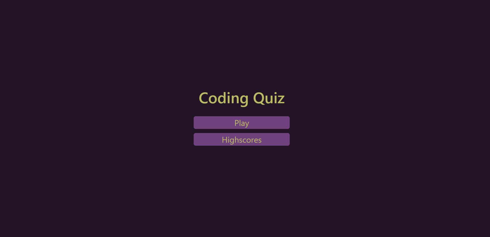

# JavaScript Knowledge Quiz

## Description

This application is designed to test your knowledge of JavaScript as a coding language, as well as allowing you to save your scores in order to track your progress.

- The quiz has a timer that reacts to incorrect answers, adding an element of urgency to the application as you delve into it.

## Installation

This application is currently running at: https://garrettchaney.github.io/coding-quiz/

## Usage

Upon loading the webpage, you can immediately begin to take the quiz by activating the purple 'Play' button. After completing the quiz, or failing to complete it in time, you will be presented with a form to input your name or initials in order to save your score. When you are returned to the main screen, you will be able to navigate through the 'Highscores' button in order to view your progress, as well as clear the local storage of any highscores currently populated.

## License
See attached license.

## Mockup Image

